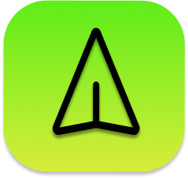
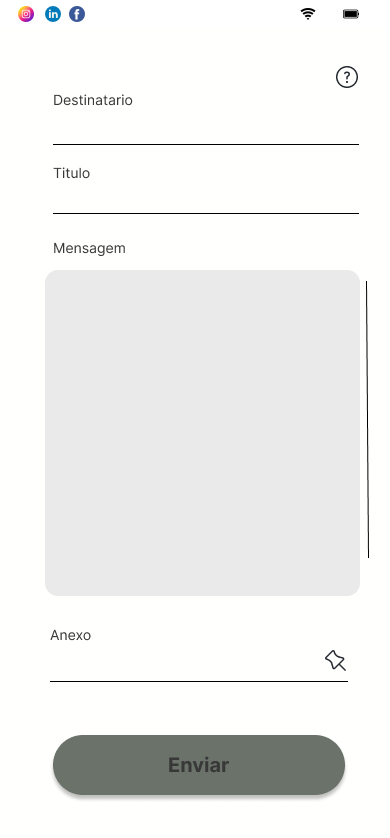

# App Solmed - SAMUELFLM

<!---Esses são exemplos. Veja https://shields.io para outras pessoas ou para personalizar este conjunto de escudos. Você pode querer incluir dependências, status do projeto e informações de licença aqui--->

>O opticMail e um sistema pensado em pessoas que queira ter maior praticidade ao enviar seus e-mails, sem a necessidade de acessar as pastas de email..
>Ainda em desenvolvimento, porém com algumas funcionalidades já funcional.

> Interface Sistema

